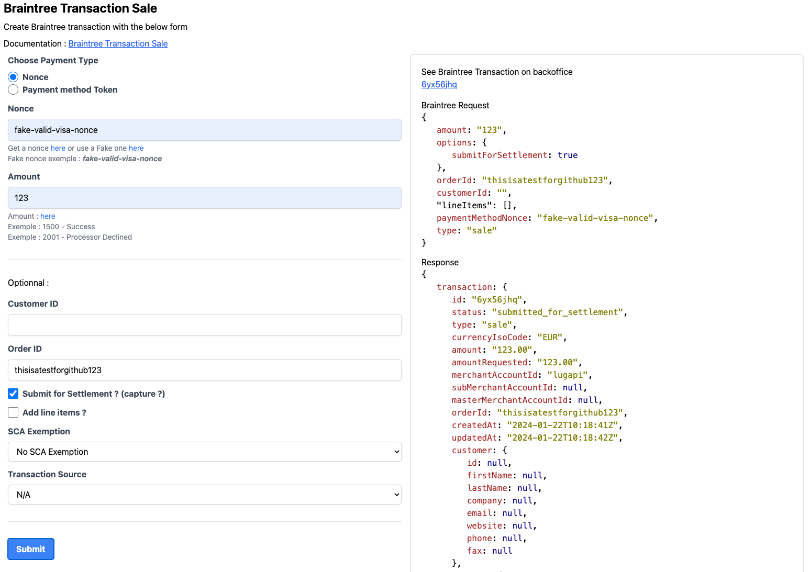
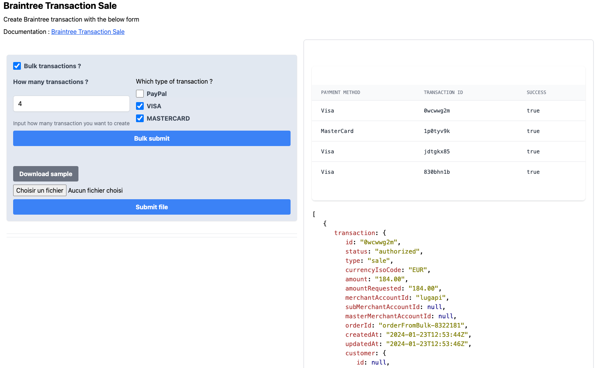

# Braintree Transaction Sale

Braintree documentation: [https://developer.paypal.com/braintree/docs/reference/request/transaction/sale/node](https://developer.paypal.com/braintree/docs/reference/request/transaction/sale/node)

## Installation

1. Clone the repository
2. Install dependencies: `npm install`

## Configuration

Duplicate `.env.exemple` to a `.env` file at the root of the project and add the necessary environment variables.

## How to Run

To start the project, run the following command:

```bash
npm start
```

## Screenshots



<br />



<br />
